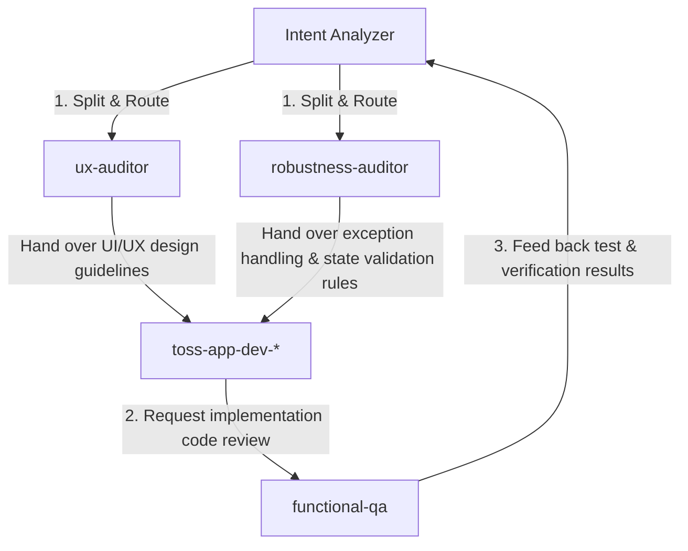

# Multi-Agent Coordination and Dispatch Protocol

This document defines the standard collaboration procedures for splitting tasks among specialized expert agents based on the conclusions analyzed by the Intent Analyzer, and for facilitating mutual cooperation and consensus.

## 1. Dependency Map by Agent
Defines the sequential relationships and collaboration points between each agent.

