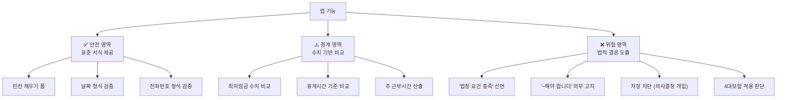

# ⚖️ 법적 리스크 분석: 변호사법·공인노무사법 저촉 여부

> 분석일: 2026-06-12 | 대상: `validation.ts` 검증 엔진 + UI 표현 전수 분석
> 
> **⚠️ 본 분석은 기술적 관점의 리스크 식별이며, 최종 법적 판단은 반드시 변호사·공인노무사의 자문을 받아야 합니다.**

---

## 1. 관련 법률 & 핵심 판례

### 변호사법 제109조 (비변호사의 법률사무 취급 금지)
> 변호사가 아닌 자가 **금품·이익을 받거나 받을 것을 약속**하고 법률사무를 취급하는 것을 금지

### 공인노무사법 제2조 (직무)
> 공인노무사의 직무: **노동 관계 법령에 따른 서류 작성·확인**, 노동 관계 법령과 **노무관리에 관한 상담·지도**

### 대법원 2025두35483 판결 (2026.02.12 선고) — '로폼' 사건
대법원이 제시한 **합법/위법 경계선**:

```
┌─────────────────────────────────────────────────────┐
│  ✅ 합법 (법률사무 취급에 해당하지 않음)               │
│  ─────────────────────────────────────────────────  │
│  • 표준화된 서식을 디지털로 제공                       │
│  • 이용자가 빈칸을 채우고, 프로그램이 수정 없이 반영      │
│  • 구체적·개별적 사안에 대한 법적 판단이 개입되지 않음    │
├─────────────────────────────────────────────────────┤
│  ❌ 위법 가능성 높음                                  │
│  ─────────────────────────────────────────────────  │
│  • 구체적·개별적 사안을 파악하여 법규를 검토             │
│  • 법적 추론 및 평가를 수행                            │
│  • "법정 요건을 충족한다"는 결론을 내림                  │
│  • 사건 검토 서비스를 유료로 제공                       │
│  • 변호사·노무사 알선 행위                             │
└─────────────────────────────────────────────────────┘
```

---

## 2. 현재 앱의 기능별 법적 분석

### 2-1. 계약서 양식 제공 자체 → ✅ 합법 가능성 높음

| 기능 | 법적 성격 | 판단 근거 |
|------|-----------|-----------|
| 표준 근로계약서 양식 제공 | 서식 제공 | 고용노동부 표준양식의 디지털화에 해당 |
| 사용자가 직접 빈칸 채우기 | 이용자 자율 작성 | 프로그램이 내용을 수정·변경하지 않음 |
| 계약 유형 선택 (정규직/단시간/기간제) | 서식 선택 | 법적 판단 개입 없음 |
| Zod 형식 검증 (전화번호 형식, 날짜 형식) | 입력값 유효성 | 법률 판단이 아닌 순수 기술적 검증 |

### 2-2. 법정 규칙 검증 엔진 → ⚠️ 경계선 영역

여기서부터 리스크가 발생합니다. 코드 레벨에서 하나씩 분석합니다.

#### 검증 규칙별 위험도 매트릭스

| # | 검증 규칙 | 코드 위치 | 성격 | 위험도 | 이유 |
|---|-----------|-----------|------|--------|------|
| 1 | **날짜 역전 방지** | [L106-114](file:///Users/ganghyeon-ug/Desktop/%F0%9F%92%BC%20%ED%94%84%EB%A1%9C%EC%A0%9D%ED%8A%B8/AI_Agents/TOSS/toss-contract-app/src/domain/contract/validation.ts#L106) | 산술 비교 | 🟢 낮음 | 단순 입력 오류 방지 (법적 판단 아님) |
| 2 | **최저임금 미달** | [L117-134](file:///Users/ganghyeon-ug/Desktop/%F0%9F%92%BC%20%ED%94%84%EB%A1%9C%EC%A0%9D%ED%8A%B8/AI_Agents/TOSS/toss-contract-app/src/domain/contract/validation.ts#L117) | 공시 기준값 비교 | 🟡 중간 | 고시된 수치 단순 비교 → 비교적 안전하나, "위반"이라는 표현이 문제 |
| 3 | **최저임금 근접 경고** | [L124-133](file:///Users/ganghyeon-ug/Desktop/%F0%9F%92%BC%20%ED%94%84%EB%A1%9C%EC%A0%9D%ED%8A%B8/AI_Agents/TOSS/toss-contract-app/src/domain/contract/validation.ts#L124) | 판단 + 권고 | 🟠 높음 | **"최저임금 위반 가능성을 검토하세요"** → 법적 평가에 해당할 소지 |
| 4 | **휴게시간 부족** | [L136-156](file:///Users/ganghyeon-ug/Desktop/%F0%9F%92%BC%20%ED%94%84%EB%A1%9C%EC%A0%9D%ED%8A%B8/AI_Agents/TOSS/toss-contract-app/src/domain/contract/validation.ts#L136) | 법정 기준 비교 | 🟡 중간 | 근로기준법 제54조 기준 산술 비교 |
| 5 | **주휴일 누락** | [L169-175](file:///Users/ganghyeon-ug/Desktop/%F0%9F%92%BC%20%ED%94%84%EB%A1%9C%EC%A0%9D%ED%8A%B8/AI_Agents/TOSS/toss-contract-app/src/domain/contract/validation.ts#L169) | 법정 기준 비교 | 🟡 중간 | 주 15시간 기준 산술 비교 |
| 6 | **주휴일-근무일 겹침** | [L178-189](file:///Users/ganghyeon-ug/Desktop/%F0%9F%92%BC%20%ED%94%84%EB%A1%9C%EC%A0%9D%ED%8A%B8/AI_Agents/TOSS/toss-contract-app/src/domain/contract/validation.ts#L178) | 논리적 모순 감지 | 🟢 낮음 | 단순 입력 오류 방지 |
| 7 | **단시간 근로자 경고** | [L192-199](file:///Users/ganghyeon-ug/Desktop/%F0%9F%92%BC%20%ED%94%84%EB%A1%9C%EC%A0%9D%ED%8A%B8/AI_Agents/TOSS/toss-contract-app/src/domain/contract/validation.ts#L192) | 정보 제공 | 🟡 중간 | "제외될 수 있습니다" 표현은 비교적 안전 |
| 8 | **유급휴가 미포함** | [L202-209](file:///Users/ganghyeon-ug/Desktop/%F0%9F%92%BC%20%ED%94%84%EB%A1%9C%EC%A0%9D%ED%8A%B8/AI_Agents/TOSS/toss-contract-app/src/domain/contract/validation.ts#L202) | 법적 의무 고지 | 🟠 높음 | **"부여해야 합니다"** → 법적 결론을 내림 |
| 9 | **4대보험 미포함** | [L211-218](file:///Users/ganghyeon-ug/Desktop/%F0%9F%92%BC%20%ED%94%84%EB%A1%9C%EC%A0%9D%ED%8A%B8/AI_Agents/TOSS/toss-contract-app/src/domain/contract/validation.ts#L211) | 법적 의무 고지 | 🟠 높음 | 4대보험 적용 여부는 개별 사업장 상황에 따라 다름 |
| 10 | **퇴직금 미포함** | [L220-227](file:///Users/ganghyeon-ug/Desktop/%F0%9F%92%BC%20%ED%94%84%EB%A1%9C%EC%A0%9D%ED%8A%B8/AI_Agents/TOSS/toss-contract-app/src/domain/contract/validation.ts#L220) | 법적 의무 고지 | 🟠 높음 | **"지급해야 합니다"** → 법적 결론 |

---

## 3. 핵심 위험 요소 5건

### 🔴 위험 요소 1: UI에서 "법정 검증"이라는 명칭 사용

**현재 코드** ([ContractFormPage.tsx#L489-L503](file:///Users/ganghyeon-ug/Desktop/%F0%9F%92%BC%20%ED%94%84%EB%A1%9C%EC%A0%9D%ED%8A%B8/AI_Agents/TOSS/toss-contract-app/src/pages/employer/ContractFormPage.tsx#L489)):
```
Step 5 제목: "법정 검증 결과"
성공 메시지: "법정 요건을 충족하는 계약서입니다."
```

**문제점**: 
- "법정 검증"이라는 표현은 **법적 권한을 가진 주체가 적법성을 확인**하는 것으로 오인될 수 있음
- "법정 요건을 충족한다"는 **법적 결론**을 앱이 내리는 것 → 공인노무사법상 **"노동 관계 법령에 관한 상담·지도"**에 해당할 소지

### 🔴 위험 요소 2: Warning 메시지의 법적 조언 성격

**현재 코드** ([validation.ts#L130](file:///Users/ganghyeon-ug/Desktop/%F0%9F%92%BC%20%ED%94%84%EB%A1%9C%EC%A0%9D%ED%8A%B8/AI_Agents/TOSS/toss-contract-app/src/domain/contract/validation.ts#L130)):
```typescript
"최저임금 위반 가능성을 검토하세요."
"부여해야 합니다."
"지급해야 합니다."
```

**문제점**:
- "~해야 합니다"는 **법적 의무를 고지**하는 표현 → 단순 정보 제공을 넘어선 **지도(指導)** 성격
- 개별 사업장의 인원 수, 근로형태 등을 고려하지 않고 일률적으로 경고 → 부정확한 법적 결론

### 🔴 위험 요소 3: 검증 엔진이 "저장 차단"까지 하는 구조

**현재 설계 의도** (PRD):
> 검증 결과가 `valid === false`일 때 계약서 저장을 차단해야 함

**문제점**:
- 앱이 사용자의 계약 체결을 **법적 판단에 기반하여 거부**하는 것
- 이는 단순 도구를 넘어 **의사결정에 직접적인 영향**을 미침
- 공인노무사법상 "노무관리진단"으로 해석될 위험

### 🟡 위험 요소 4: 4대보험 개별 적용 판단의 복잡성

**현재 코드**: 
- "4대보험 미포함" 시 일률적으로 경고
- 실제로는 사업장 인원(1인/5인/상시근로자 수), 근로시간(월 60시간), 근속기간(3개월) 등에 따라 적용 여부가 달라짐
- 이 복잡한 판단을 자동화하면 **"개별 사업장의 구체적 상황 분석"** → 공인노무사 직무 영역

### 🟡 위험 요소 5: 면책조항 부재

**현재 코드**: 
- 앱 어디에도 "법률 자문이 아니다"는 고지가 없음
- 이용약관/서비스 소개에 면책 문구 없음

---

## 4. 대법원 판례 기준 앱 기능 분류



---

## 5. 대응 방안

### 방안 A: "정보 제공 도구"로 리포지셔닝 (🔵 권장)

대법원 판례의 합법 기준인 **"표준 서식 제공 + 구체적 법적 판단 미개입"**을 충족하도록 조정:

#### 5-A-1. UI 문구 전면 수정

| 현재 표현 | 수정 제안 | 이유 |
|-----------|-----------|------|
| `"법정 검증 결과"` | `"입력 정보 확인"` 또는 `"자동 계산 결과"` | "법정 검증"은 법적 권한을 암시 |
| `"법정 요건을 충족하는 계약서입니다"` | `"입력된 수치가 참고 기준 내에 있습니다"` | "법정 요건 충족"은 법적 결론 |
| `"최저임금 위반 가능성을 검토하세요"` | `"입력된 시급이 2026년 고시 최저시급(10,030원)보다 낮습니다"` | 사실만 전달, 판단은 사용자에게 |
| `"부여해야 합니다"` | `"근로기준법 제60조에 관련 규정이 있습니다"` | 의무 고지 → 법률 참조 안내 |
| `"지급해야 합니다"` | `"퇴직급여보장법에 관련 규정이 있습니다"` | 동일 |
| `"수정이 필요한 항목"` | `"확인이 필요한 항목"` | "수정 필요"는 지도 성격 |

#### 5-A-2. 면책조항 추가 (필수)

앱 내 **3곳**에 면책 고지 삽입:

1. **검증 결과 화면 하단** (Step 5):
```
ℹ️ 본 확인 결과는 공시된 기준값과의 단순 비교이며, 
법률 자문을 대체하지 않습니다. 구체적인 노무 관련 
사항은 공인노무사 또는 변호사에게 상담하시기 바랍니다.
```

2. **계약서 작성 시작 시** (온보딩):
```
본 서비스는 근로계약서 양식 작성을 돕는 도구입니다.
법적 효력에 대한 최종 판단은 전문가에게 확인해주세요.
```

3. **서비스 이용약관**

#### 5-A-3. 검증 엔진 동작 방식 조정

```diff
- // 현재: Error → 저장 차단
- if (!result.valid) { return; /* 저장 불가 */ }

+ // 변경: Warning으로 통일 → 저장 허용 + 확인 요청
+ if (result.warnings.length > 0) {
+   // "아래 항목을 확인한 후 계속하시겠습니까?" 확인 대화상자
+   const confirmed = await confirm(
+     '확인이 필요한 항목이 있습니다. 계속 저장하시겠습니까?'
+   );
+   if (!confirmed) return;
+ }
```

**핵심**: 앱이 저장을 **차단**하는 것(의사결정 개입)이 아닌, **정보를 제공**하고 사용자가 판단

#### 5-A-4. 코드 내 용어 정리

```diff
- // validation.ts
- export interface ValidationError {
+ export interface InputCheckResult {

- code: "BELOW_MINIMUM_WAGE",
+ code: "WAGE_BELOW_REFERENCE",

- code: "MISSING_WEEKLY_HOLIDAY",
+ code: "WEEKLY_HOLIDAY_NOT_SET",

- code: "INSUFFICIENT_BREAK",
+ code: "BREAK_TIME_BELOW_REFERENCE",
```

### 방안 B: 검증 기능 범위 축소 (🟡 보수적)

법적 리스크를 최소화하려면:

- **유지**: 날짜 역전, 주휴일-근무일 겹침 (논리적 모순 감지)
- **유지하되 문구 수정**: 최저임금 비교, 휴게시간 비교 (공시 기준 비교)
- **제거 검토**: 유급휴가/4대보험/퇴직금 경고 (개별 사업장 상황에 따라 적용 여부가 달라지므로 일률적 경고는 위험)

### 방안 C: 전문가 감수 구조 도입 (🟠 장기)

- 공인노무사와 협업하여 검증 규칙에 대한 감수를 받고, "OO노무사 감수" 표기
- 단, 이 경우에도 앱이 법적 자문을 "대리"하는 것이 아니라 "감수받은 기준을 안내"하는 형태여야 함

---

## 6. 결론 및 즉시 조치 사항

> [!CAUTION]
> ### 출시 전 반드시 해야 할 3가지
> 
> 1. **변호사 또는 공인노무사에게 앱 시연 후 법적 자문을 받으세요**
>    - 본 분석은 기술적 관점의 식별이며, 실제 위법 여부는 전문가만 판단 가능
>    - 특히 앱인토스 환경에서 유료 수익 모델이 있다면 "금품을 받고 법률사무를 취급" 요건 해당 여부 검토 필요
> 
> 2. **UI 문구를 즉시 수정하세요** (방안 A-1)
>    - `"법정 검증"` → `"입력 정보 확인"` 
>    - `"법정 요건을 충족"` → `"참고 기준 내에 있습니다"`
>    - `"~해야 합니다"` → `"관련 규정이 있습니다"`
>
> 3. **면책조항을 반드시 추가하세요** (방안 A-2)
>    - 검증 화면, 온보딩, 이용약관 3곳에 삽입
>    - "본 서비스는 법률 자문을 대체하지 않습니다"

### 현재 코드의 법적 위험도 요약

```
표준 서식 제공:    ████████████████████ 안전
형식 검증 (Zod):   ████████████████████ 안전  
수치 비교 (최저임금): ████████████████░░░░ 경계 (문구 수정 필요)
법적 결론 ("충족"): ████████░░░░░░░░░░░░ 위험 (즉시 수정)
의무 고지 ("해야"):  ████████░░░░░░░░░░░░ 위험 (즉시 수정)
저장 차단:         ██████░░░░░░░░░░░░░░ 위험 (구조 변경 필요)
면책조항 부재:     ████░░░░░░░░░░░░░░░░ 위험 (즉시 추가)
```

---

> **참고 판례**: 대법원 2025두35483 (2026.02.12) — 리걸테크 '로폼' 자동작성 서비스 변호사법 미위반 확정
> 
> **참고 법률**: 변호사법 제109조, 공인노무사법 제2조, 근로기준법 제17조·제54조·제55조·제60조
> 
> **⚠️ 본 분석은 AI에 의한 기술적 리스크 식별이며, 법률 자문이 아닙니다. 최종 판단은 반드시 법률 전문가에게 의뢰하세요.**
