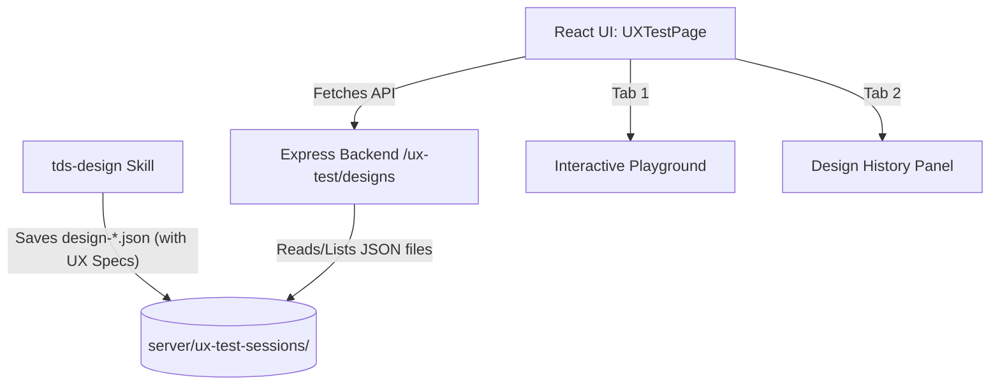

# 🎯 Design History Page Implementation Plan (with Mandatory UX Evaluation)

This document outlines the detailed development plan for integrating a **Design History** visualization panel inside the UX Flow Test Workspace (`http://localhost:5173/dev/ux-test`).
This page acts as a persistent archive for UI design alternatives proposed and generated by the `tds-design` skill.

---

## 📌 1. Feature Overview & Design Requirements

The `tds-design` skill creates two types of JSON files under `server/ux-test-sessions/` during its lifecycle:
1. **UI Proposals**: `design-{timestamp}.json` containing up to 5 token-minimal layout proposals.
2. **UI Specs**: `design-{timestamp}-spec.json` containing the comprehensive design specification for implementation.

### Key Goals:
- **Workspace Navigation Extension**: Add a beautiful tab interface inside `UXTestPage.tsx` dividing "Interactive Playground" (the current simulation workspace) and "Design History Dashboard".
- **Design Proposal Visualizer**: Render the 5 proposed layouts side-by-side in cards with component metadata, patterns, and estimated tokens.
- **Mandatory UX Evaluation Flow (New)**: Enforce a structured input flow that maps the **Design Intent & Philosophy**, **Expected Impact**, and a detailed **Pros & Cons** analysis grounded in established **UX Theories** (e.g., Hick's Law, Fitts's Law, Miller's Law, Jakob's Law, Gestalt Principles).
- **Spec Schema Renderer**: Build an interactive tree-view parser for selected specs that visualizes the component tree, state bindings, interactions, reference files, and the mandatory UX evaluation segment.
- **API Support**: Add backend Express routes to serve, upload, and read these design assets.

---

## 🏗️ 2. Architectural Design



### 2.1 Schema Definition for Mandatory UX Evaluation (`uxEvaluation` field)
Every `design-*-spec.json` file must include the following schema structure to pass verification:

```json
{
  "uxEvaluation": {
    "philosophyAndIntent": "The core design philosophy and underlying intent (e.g., 'Reducing cognitive friction for contract creation').",
    "expectedImpact": "Quantifiable or qualitative expected improvements in task completion time or user trust.",
    "pros": [
      {
        "theory": "Hick's Law / Fitts's Law / Gestalt Principles etc.",
        "rationale": "Why this specific layout choice increases usability based on the referenced UX theory."
      }
    ],
    "cons": [
      {
        "theory": "Miller's Law / Jakob's Law etc.",
        "rationale": "Identified trade-offs or usability bottlenecks and how they are mitigated."
      }
    ]
  }
}
```

### 2.2 Backend Express API Routes (`server/src/routes/ux-test.ts`)
We will expose the following REST endpoints:
- `GET /api/ux-test/designs`: Lists all `design-*.json` and `design-*-spec.json` files sorted by timestamp (newest first).
- `GET /api/ux-test/designs/:filename`: Serves the JSON contents of a specific design file.
- `POST /api/ux-test/designs/upload`: Endpoint for the `tds-design` skill to save new proposals/specs remotely during execution.

### 2.3 Frontend UI Structure (`src/pages/dev/UXTestPage.tsx`)
We will introduce a state `activeTab` ('playground' | 'design-history'):
- **Tab 1: Playground**: Retains the restored 2-split live playhouse frames and the 12 overview dashboard cards.
- **Tab 2: Design History**: Displays a master-detail split layout:
  - **Left Sidebar**: Timeline list of all design session proposals and specifications.
  - **Main Viewport**: Renders the selected proposal's cards (A to E) or the structural specification tree.
  - **UX Evaluation Card**: A prominent card rendering the **Design Intent & Philosophy**, **Expected Impact**, and **UX Theory Pros & Cons** side-by-side with color-coded badges for easy reading.

---

## 📋 3. Step-by-Step Task Breakdown

### Phase 1: Express Backend Implementation (Task 1)
+ [x] Update `server/src/routes/ux-test.ts` to add endpoints for listing, reading, and uploading design history JSON files.
+ [x] Implement robust error handling if the `ux-test-sessions` directory is missing or empty.
+ [x] Validate backend routes using a simple fetch script or manual curls.

### Phase 2: Tab System Integration in Frontend (Task 2)
+ [x] Add `activeTab` state in `UXTestPage.tsx` and design a sleek, premium TDS-like sub-navigation bar in the workspace header.
+ [x] Ensure that existing simulation telemetry and log listeners do not degrade when toggling tabs.

### Phase 3: Proposal Comparison Dashboard (Task 3)
+ [x] Create a timeline viewer that lists all available design history runs.
+ [x] Parse `design-{timestamp}.json` files and render a beautiful comparison card grid representing the 5 layout patterns.
+ [x] Display layout patterns, component lists, estimated token metrics, and short descriptions clearly.

### Phase 4: Full Spec & UX Evaluation Visualizer (Task 4)
+ [x] Parse `design-{timestamp}-spec.json` specs.
+ [x] Render a hierarchical, interactive tree representation of the `componentTree` showing the parent-child relationships and component props.
+ [x] Render the new **UX Evaluation Card** displaying Philosophy/Intent, Expected Impact, and Theory-based Pros & Cons in structured lists.
+ [x] Create badge indicators highlighting which states are bound to which component (`stateBindings`) and list the defined `interactions`.
+ [x] Link the specified `referenceFiles` as click-to-copy paths.

### Phase 5: Verification & Safety Guards (Task 5)
+ [x] Run Vite dev validation to confirm compile-safety.
+ [x] Call our expert OMP subagents to double-check that no Granite guidelines, RLS policies, or Vite rules are broken.
