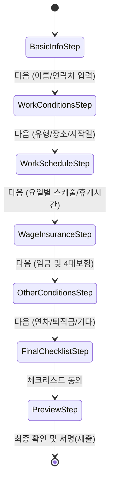

# Employer Contract Form UX Flow & E2E Spec

이 문서는 토스 근로계약서 작성 폼(`toss-contract-app`)의 사용자 경험(UX) 흐름과 E2E 테스트 검증을 위한 통합 명세서입니다.

---

## 1. 전반적인 작성 흐름 (Happy Path)

### 단계별 진입 조건 및 전환
- 사용자는 `useContractForm` 훅의 `validateStep(step)` 함수가 통과되어야만 다음 단계로 넘어갈 수 있습니다.
- 모든 진행 내역은 세션 스토리지(`wiz_form`)에 저장되어 중간에 이탈해도 데이터가 보존됩니다.

---

## 2. 단계별 UX 명세 및 Validation 에러 조건

### Step 1: 근로자 정보 (BasicInfoStep)
- **입력 항목**: 근로자 이름 (`worker_name`), 전화번호 (`worker_phone`)
- **Validation 에러 조건**:
  - `worker_name` 미입력 시: `"이름을/를 입력해주세요"`
  - `worker_phone` 10자리 미만 시: `"정확한 전화번호를 입력해주세요"`
- **UX 인터랙션**: 전화번호는 숫자 패드로 입력받으며, 형식(010-XXXX-XXXX) 자동 변환을 적용.

### Step 2: 계약 조건 (WorkConditionsStep)
- **입력 항목**: 계약 유형 (`contract_type`), 근무 장소 (`workplace`), 직무 내용 (`job_description`), 시작일 (`start_date`)
- **Validation 에러 조건**:
  - `contract_type` 미선택 시: `"계약 유형을 선택해주세요"`
  - `workplace` 미입력 시: `"근무 장소을/를 입력해주세요"`
  - `job_description` 미입력 시: `"직무 내용을/를 입력해주세요"`
  - `start_date` 미입력 시: `"시작일을/를 선택해주세요"`
  - 시작일보다 종료일(`end_date`)이 빠를 경우: `"종료일은 시작일보다 이후여야 합니다."` (도메인 검증)
- **UX 인터랙션**: 사업장 정보가 등록되어 있다면 `workplace`는 해당 사업장 주소로 자동 채워짐. 시작일은 DatePicker 바텀시트로 제공.

### Step 3: 근무 시간 (WorkScheduleStep)
- **입력 항목**: 근무 요일 (`work_days`), 스케줄 모드 (`schedule_mode`: 모든 요일 동일/요일별 다름), 근무 및 휴게시간 (`work_schedule`), 주휴일 (`weekly_holiday`)
- **Validation 에러 조건**:
  - `work_days` 미선택 시: `"근무 요일을/를 선택해주세요"`
  - `weekly_holiday` 미선택 시: `"주휴일을 선택해주세요"`
  - 각 요일의 시작/종료 시간이 없을 때: `"{요일}요일의 근무시간을 입력해주세요"`
  - 시작 시간 >= 종료 시간 일 때: `"{요일}요일 종료 시간은 시작 시간보다 늦어야 합니다"`
- **UX 인터랙션**: 
  - '매일 동일' 스위치 On/Off에 따라 UI 변화. '매일 동일' 시 첫 근무요일 기준으로 전체 요일 동기화됨.

### Step 4: 임금 및 보험 (WageInsuranceStep)
- **입력 항목**: 임금 유형 (`wage_type`), 기본급 (`base_wage`), 지급일 (`wage_payment_day`), 산재보험 등 4대보험 여부.
- **Validation 에러 조건**:
  - `base_wage` <= 0 일 때: `"금액을/를 입력해주세요"`
  - `wage_payment_day` 미선택 시: `"지급일을 선택해주세요"`
  - `accident_insurance` False 시: `"산재보험은 전 사업장 의무가입입니다"`
- **UX 인터랙션**: 
  - 근무 시간에 따라 국민연금, 건강보험, 고용보험의 자동 체크 여부가 변경됨 (예: 주 15시간 이상, 1개월 이상 근무 시 자동 체크).

### Step 5: 기타 조건 (OtherConditionsStep)
- **입력 항목**: 연차 유급휴가, 퇴직금, 기타조건 텍스트

### Step 6: 체크리스트 (FinalChecklistStep)
- **입력 항목**: 체크리스트 동의 여부 (`checklist_agreed`)
- **Validation 에러 조건**:
  - 사업장 정보 부재 시: 얼럿 창 표출 후 사업장 등록 페이지(`/employer/business/new`)로 이동.
  - 미동의 시: `"체크리스트 확인에 동의해주세요"`

### Step 7: 최종 확인 (PreviewStep)
- 모든 폼 데이터를 `buildContractData` 로 변환 후, 제출.
- 서명이 완료되거나 발송된 계약을 수정하려고 접근 시 얼럿 표출 및 상세 페이지로 리다이렉트 처리됨.

---

## 3. 도메인 Validation Edge Cases (주의 시나리오)

E2E 및 단위 테스트 시 다음 엣지 케이스들을 필수적으로 검증해야 합니다. (`src/domain/contract/validation.ts` 기준)

### 3.1 임금 (최저임금 관련)
- **Error (최저임금 미달)**: 
  - `base_wage`를 시급으로 환산했을 때 10,030원 미만인 경우. 
  - 표출 에러: `"시급 환산 시 ...원으로 최저임금(10,030원)에 미달합니다."`
- **Warning (최저임금 인접 경고)**: 
  - 최저시급 대비 110% 미만일 때 소프트 경고 노출.

### 3.2 근무 및 휴게시간
- **Error (야간 근무 역전 및 오류 방지)**:
  - 심야 근무(예: 22:00 ~ 06:00)의 경우 종료 시간이 시작 시간보다 빨라 보여도 익일로 간주되어 8시간으로 정상 계산됨.
- **Error (법정 휴게시간 위반)**:
  - 4시간 이상 근무 시 30분 미만 휴게: `"일 4시간 이상 근무 시 휴게시간 30분 이상 필요"`
  - 8시간 이상 근무 시 60분 미만 휴게: `"일 8시간 이상 근무 시 휴게시간 60분 이상 필요"`

### 3.3 주휴일 및 주 15시간 미만 (단시간 근로자)
- **Error (주휴일 중복)**: 
  - `weekly_holiday`로 선택한 요일이 `work_days`에 포함되어 있을 때: `"주휴일(...)이 근무일에 포함되어 있습니다."`
- **Error (주휴일 누락)**:
  - 주 근무시간이 15시간 이상인데 주휴일 미지정 시 에러.
- **Warning (단시간 근로자 주휴수당 제외 안내)**:
  - 주 근무시간이 15시간 미만일 때 소프트 경고 노출: `"주 15시간 미만 근로자는 주휴수당 대상에서 제외될 수 있습니다."`

### 3.4 필수 조항 누락 경고
- 연차 유급휴가, 4대보험, 퇴직금 조항이 누락(체크 해제)된 경우, 각각에 대해 근로기준법/퇴직급여보장법을 인용한 소프트 경고 문구(Warning) 노출.

---

## 4. 풀 사이클 통합 E2E 테스트 시나리오 (Full-cycle Journey)

이 섹션은 유저의 회원가입부터 계약 완료까지 이어지는 엔드투엔드(End-to-End) 생애 주기 테스트 케이스를 정의합니다.

### 4.1 인증 파트 (Auth Flow)
* **[Case 1] 신규 사장님 회원가입 (Happy Path):** 회원가입 진입 → 이메일/비밀번호/이름/휴대폰번호 입력 → 검증 통과 → 가입 완료 후 자동 로그인
* **[Case 2] 기존 사장님 로그인 (Happy Path):** 로그인 진입 → 유효한 자격 증명 입력 → 로그인 성공 → 홈 화면(`/employer/home`) 리다이렉트
* **[Case 3] 인증 실패 및 라우트 가드 (Edge Cases):** 잘못된 비밀번호 입력 에러 확인, 중복 이메일 가입 차단, 비로그인 상태로 `/employer/contracts/new` 직접 접근 시 로그인 화면으로 튕겨냄

### 4.2 온보딩 및 홈 (Home & Onboarding Flow)
* **[Case 4] 첫 로그인 시 사업장 등록:** 등록된 사업장이 없을 때 바텀시트/페이지 오픈 → 사업장 정보(상호, 주소, 사업자번호) 등록
* **[Case 5] 홈 화면 렌더링 검증:** 로그인 후 홈 화면에 사업장 이름 정상 노출 및 "새 계약서 작성" 버튼 활성화 여부

### 4.3 근로계약서 작성 (Contract Form Flow)
* **[Case 6] 정상 작성 (Happy Path):** 위 1~7단계 정상 입력 진행 (정규직 및 단시간 근로자 케이스 분리 테스트)
* **[Case 7] 주요 유효성 검사 차단 (Edge Cases):** 시급 미달(9000원), 휴게시간 부족 등 고의적 에러 발생 → 최종 체크리스트 단계에서 제출 차단 및 에러/수정하기 버튼 노출 검증

### 4.4 서명 및 계약 완료 (Sign & Complete Flow)
* **[Case 8] 사장님 서명 진행:** 체크리스트 동의 후 서명 패드 진입 → 전자 서명(Canvas) 입력 → 완료 버튼 클릭
* **[Case 9] 발송 및 최종 완료 화면:** 서명 완료 후 근로자 발송 모달 노출 → 카카오톡 전송 클릭 → 폭죽 애니메이션과 함께 최종 완료 화면 렌더링 확인

---

**[작성자 가이드]**   **E2E Framework:** Puppeteer (Headless 환경 실행 권장).
*   **환경 설정:** 실제 API 호출 대신, `sessionStorage` (예: `mock_role`, 토큰 등) 또는 Service Worker 기반의 Mock 데이터를 활용하여 독립적인 테스트 환경 구축.
*   **시나리오 단위:** 각 케이스별로 독립된 스크립트 작성 (`case1_signup.cjs`, `case2_login.cjs` 등).
*   **테스트 검증 룰:** UI가 보이지 않는 현상을 회피하기 위해 전역 객체(window)를 오염시키지 말고, CSS 애니메이션 무효화(`animation: none !important;`)를 주입하여 테스트 안정성 확보. 정확한 조사를 고려해야 합니다.
